# Neko Atsume Analysis

A tool for optimizing your Neko Atsume yard setup to maximize fish earnings and cat visits. Algorithms based on Neko Atsume 2 V1.0.0. Data based on Neko Atsume 2 V1.2.0.

## Description

This tool analyzes different yard configurations in Neko Atsume to help you:
- Calculate expected fish earnings (both silver and gold)
- Determine probabilities of specific cats visiting
- Account for indoor/outdoor placement considerations, which is crucial for computing gold fish earning rate
- Handle item damage states
- Consider cat-on-cat interactions and preferences
- Deal with loss of precision (rounding down)
- Custom grouping options for analyzing specific item combinations for your yard

## A Note for New Players
If you are here, you are definitely trying to min-max the game :). I hear ya. One suggestion for you is to use silver fish to get the expansion asap. 
1. The conversion rate is more favorable (1:27.8) than other types. Other ones which is almost 25.
2. It's just faster. Suppose you only have Beach Umbrella, (5000 + 340 + 12.28 / 24 * 8 * 10) / 438.127 = 12.28 days (assuming you have food ALL THE TIME) vs 180 / 9.490 = 18.96 days. A full yard can save you 40% of the time to get to that juicy expansion.
3. You double the gold fish income when indoors, which is only available after getting the expansion. 

Finally, this is a chill, cute cat collection game, so please just have fun and close this page if you want!! (I'm definitely not doing it right.)

## Installation

```bash
git clone https://github.com/catlover627/neko-atsume-analysis.git
cd neko-atsume-analysis
pip install numpy pandas
```

## Usage

Basic usage example:
```bash
python analyze.py --food_type 2 --output_type gold_equiv
```

To analyze probability of a specific cat appearing (You can find the cat id to name mapping [here](data/cat_id_to_name.json)):
```bash
python analyze.py --output_type cat_probability --cat_id 24
```

To analyze custom item groups:
```bash
python analyze.py --group_def custom --items_of_interest_indoors 1 2 3 --items_of_interest_outdoors 4 5 6
```

## Command-Line Arguments

| Argument | Type | Default | Description |
|----------|------|---------|-------------|
| `--food_type` | int | 2 | Type of food to place:<br>1=Thrifty Bitz<br>2=Frisky Bitz<br>3=Ritzy Bitz<br>4=Bonito Bitz<br>5=Deluxe Tuna Bitz<br>6=Sashimi<br>7=Sashimi Boat<br>99=idk |
| `--item_damage_state` | int | 0 | State of item damage:<br>0=Good<br>1=Broken<br>2=Fixed |
| `--weather` | int | 0 | Weather condition:<br>0=None<br>1=Spring<br>2=Summer<br>4=Autumn<br>8=Winter<br>16=Snow<br>32=Burning |
| `--is_indoor` | bool | False | If set, considers the yard as an indoor space. Ignored when group_def is 'custom' |
| `--output_type` | str | "gold_equiv" | Type of output to generate. Options:<br>- `silver`: Silver fish<br>- `gold`: Gold fish<br>- `silver_equiv`: Silver fish equivalent<br>- `gold_equiv`: Gold fish equivalent<br>- `cat_probability`: Probability (0-1) of a specific cat appearing <br>- `stay_rate`: Summed probability (0-1) of any specific cat appearing over all playspaces |
| `--total_duration_minutes` | int | 1440 | Duration in minutes over which to aggregate the selected output_type. Ignored when output_type is 'cat_probability' |
| `--cat_id` | int | None | ID of the specific cat to analyze when output_type is 'cat_probability' |
| `--group_def` | str | "item" | Defines how to group items where a single cat cannot appear simultaneously:<br>- `playspace`: Individual seats within goodies (Turns off the consideration of whether the same can appear at different places at the same time)<br>- `item`: Entire goodie<br>- `custom`: User-defined groups via items_of_interest arguments |
| `--items_of_interest_indoors` | List[int] | None | List of goodie IDs to analyze as indoor items. Only used when group_def is 'custom' |
| `--items_of_interest_outdoors` | List[int] | None | List of goodie IDs to analyze as outdoor items. Only used when group_def is 'custom' |
| `--num_iterations_for_cat_on_cat` | int | 10 | Number of iterations to simulate cat-on-cat interactions |
| `--filter_by_na2` | bool | False | Filter results to only include items that are in NA2 |

## Output Types Explained

- **Silver/Gold Fish**: Direct count of expected fish earnings
- **Silver/Gold Equivalent**: Converts all earnings to a single currency using exchange rate. Neko Atsume 2 removed the option to go from silver to gold, but you can still "convert" it by purchasing "Selectable" items.
- **Cat Probability**: Shows likelihood (0-1) of specified cat appearing

## Examples

### Maximizing Gold Fish Earnings
```bash
# Use premium food in indoor yard
python analyze.py --food_type 5 --is_indoor --output_type gold

# Check earnings over 12 hours
python analyze.py --food_type 2 --total_duration_minutes 720
```

### Analyzing Specific Cat Visits
```bash
# Check probability of rare cat (Peaches!!) appearing
# You can find the cat id to name mapping in `data/cat_id_to_name.json`
python analyze.py --output_type cat_probability --cat_id 24 --food_type 5

# Analyze with specific weather condition
python analyze.py --output_type cat_probability --cat_id 12 --weather 1
```

### Understanding Your Yard's Gold Fish Equivalent Per Day
```bash
# Analyze specific indoor/outdoor item combinations
python analyze.py --group_def custom \
                   --items_of_interest_indoors 122 100 178 109 \
                   --items_of_interest_outdoors 258 222 106 304
```

## Contributing

Contributions are welcome! Please feel free to submit a Pull Request.

## Acknowledgments

- Based on game data from Neko Atsume 2, V1.0.0 by Hit-Point Co.,Ltd. Thanks a lot for this cute cats game!!!
- All the previous efforts! [1](https://www.reddit.com/r/nekoatsume/comments/blmtwo/neko_atsume_data_mining_spreadsheet_update_1130/), [2](https://www.reddit.com/r/nekoatsume/comments/fhwtb3/neko_atsume_datamining_webapp/), [3](https://www.reddit.com/r/nekoatsume/comments/1gb7qap/neko_atsume_2_datamining_thread/), [4](https://www.reddit.com/r/nekoatsume/comments/42cuc2/reverse_engineering_and_data_mining_neko_atsume/), [5](https://www.reddit.com/r/nekoatsume/comments/5q69v1/which_is_the_best_goodie_per_feed_goodie_analysis/) and more.

## High Level Overview


## Notes/Caveats
- After computing the same cat interaction, I should still update the cat-on-cat charm value, but I didn't do that. 
- The same cat interaction implementation is wrong. It should give some approximation. It'd be nice if someone can pick it up! 
- I did not do Sapphire & Jeeves calculation as 
    1. They are not added yet
    2. It will result in hardcoding a ton of stuff
    3. My current framework also does not support the exclusion indices they require (they take up 2 spots from other spaces, but my excluded indices supports only one spot calculation. It'd also be nice if someone can fix it)
- Most of the goodies are not in NA 2 yet!

## Todos

- Automatic optimizing the yard setup
- Include Tubbs calculation (Tubb's included in the output, but I didn't consider when they eat off the entire bowl)
- Keep it up-to-date
- Address the caveats

## Outputs 
You can find ran data in the [ran_tables](ran_tables/) folder! They are formatted as `Location, Output Type, Food, Item Damage State.md` and it accumulates the expected fish over an entire day (except for Peach Occur Chance). 